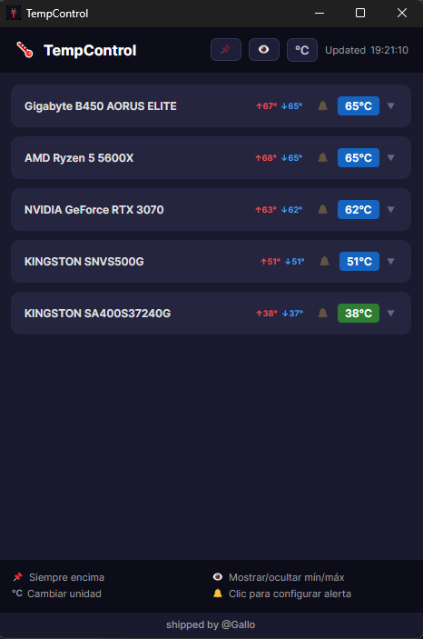

# 🌡 TempControl

Lightweight portable Windows desktop app for real-time hardware temperature monitoring. Built with Avalonia UI and .NET 9.


## Features

- **Real-time monitoring** — CPU, GPU, motherboard and storage temperatures, refreshed every 2 seconds
- **°C / °F toggle** — switch units globally with one click, thresholds convert automatically
- **Session min / max** — tracks the lowest and highest temperature seen since launch, shown inline on every sensor and group
- **Temperature alerts** — per-group configurable threshold; the card border turns red when exceeded and an alert message appears at the bottom of the window
- **Collapsible groups** — click any hardware card to expand and see individual sensor breakdown
- **Always-on-top** — pin the window to stay visible over other apps
- **Portable** — single `.exe`, no installer, no registry writes

## Screenshot



## Installation

1. Go to the [Releases](https://github.com/NachoGallo/TempControl/releases) page
2. Download `TempControl-v1.0-win-x64.zip`
3. Extract anywhere
4. Right-click `TempControl.exe` → **Run as administrator**

> **Administrator rights are required.** [LibreHardwareMonitor](https://github.com/LibreHardwareMonitor/LibreHardwareMonitor) needs elevated access to read sensor data from the hardware.

## Requirements

- Windows 10 or 11 (x64)
- No .NET runtime needed — the runtime is bundled in the executable

## Building from source

```bash
git clone https://github.com/NachoGallo/TempControl.git
cd TempControl/TempControl
dotnet run
```

To publish a self-contained portable executable:

```bash
dotnet publish -c Release -r win-x64 --self-contained true \
  -p:PublishSingleFile=true \
  -p:IncludeNativeLibrariesForSelfExtract=true \
  -p:PublishReadyToRun=true
```

Output: `bin/Release/net9.0/win-x64/publish/TempControl.exe`

## Stack

| | |
|---|---|
| UI framework | [Avalonia UI](https://avaloniaui.net/) 12.0 |
| Runtime | .NET 9 |
| Hardware sensors | [LibreHardwareMonitorLib](https://github.com/LibreHardwareMonitor/LibreHardwareMonitor) |
| MVVM | [CommunityToolkit.Mvvm](https://github.com/CommunityToolkit/dotnet) |

## License

MIT
